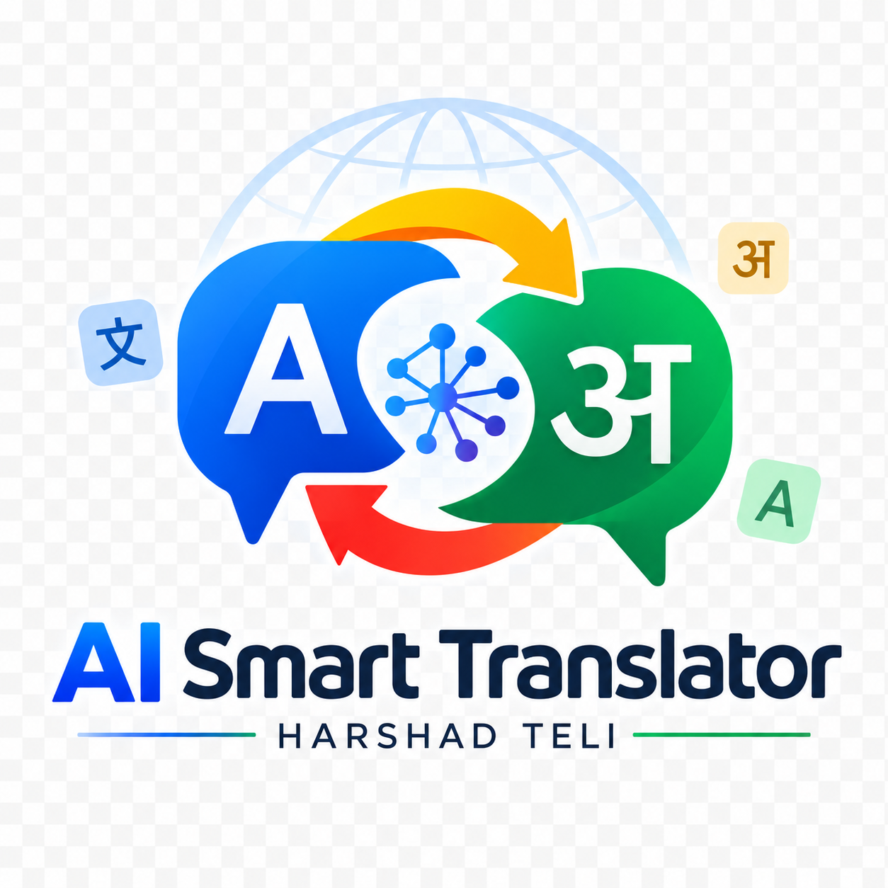
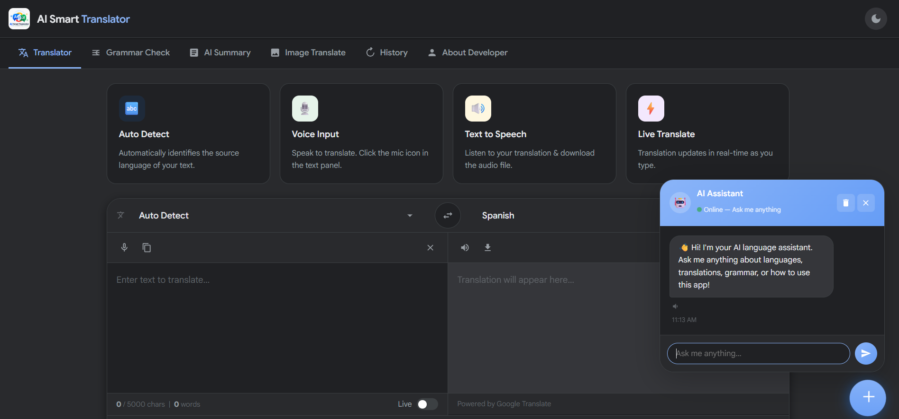
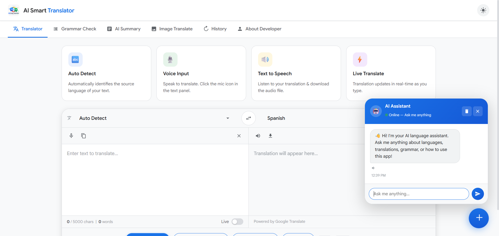
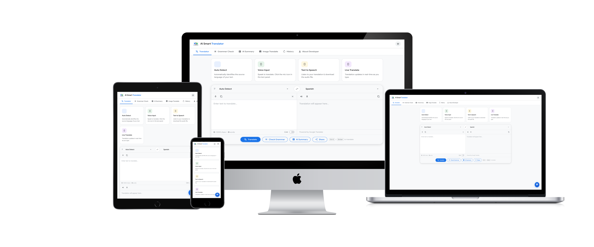

## AI Smart Translator

AI Smart Translator is a browser-based web app for fast, AI-enhanced language translation. It includes voice input, text-to-speech, OCR-based image text extraction, grammar checking, AI summarization, and a responsive chatbot UI.

  

  

## Features
- Auto language detection and quick translation
- Voice input with microphone support
- Text-to-speech playback and download
- Grammar check with quick fix suggestions
- OCR image upload for extracting text from photos
- AI-powered extractive summary generation
- Translation history for reuse and review
- Responsive design with light/dark theme support

## Project Snaps

## Project Structure
- `index.html` — main desktop/web interface
- `app.html` — alternate mobile-focused layout
- `assets/CSS/styles.css` — core app styling
- `assets/CSS/animations.css` — UI transitions and animation effects
- `assets/CSS/chatbot.css` — chatbot interface styles
- `assets/JS/` — translation logic, AI features, voice, OCR, chatbot, and utilities

## Usage
1. Open `index.html` in a modern web browser.
2. Type or paste text into the source field.
3. Select the source and target languages.
4. Use voice input, OCR, or grammar tools from the tab bar.
5. To visit the developer portfolio, click the `Visit Now` button in the About section.

## 📱 Download Android App (APK)
This application is distributed as an APK file for direct installation on Android devices. 

  

## Notes
- The app runs fully client-side and does not require a backend.
- OCR uses `tesseract.js` via CDN.
- The AI summary feature works locally without external API keys.

## Developer
Built by Harshad Teli, a full-stack and AI engineer.
